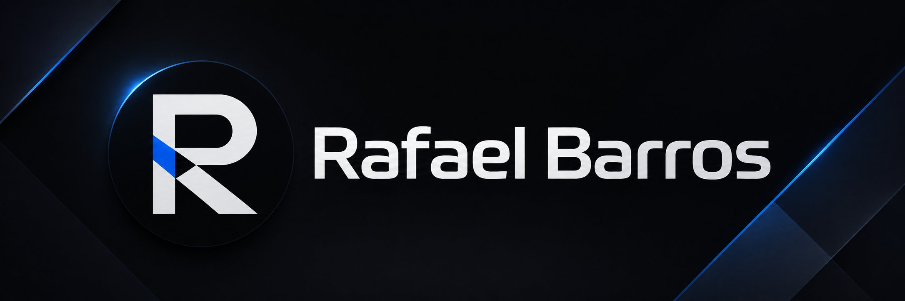

### 👨🏻‍💻 &nbsp;About Me

💡 &nbsp;I build web applications and enjoy exploring new technologies.\
🎓 &nbsp;Computer Science student at Universidade Presbiteriana Mackenzie, and a graduate in Systems Development from ETEC.\
🌱 &nbsp;Currently going deeper into React, TypeScript and the full-stack ecosystem.\
🌎 &nbsp;Native Portuguese speaker, fluent in English.\
🤝 &nbsp;Open to Front-end / Full-stack internship opportunities.\
✉️ &nbsp;Reach me at rafaelbarros0511445@gmail.com\
📄 &nbsp;Check out my [Portfolio](https://rafaelsilvabarros.dev.br) for more about my work.

🔗 &nbsp;<a href="https://fitmeta.com.br">FitMeta</a> &nbsp;·&nbsp; <a href="https://github.com/guilhermerezende10/documentation-creator">Docgen</a>

<h3 align="center">&nbsp;Connect with Me</h3>

 

 
 

